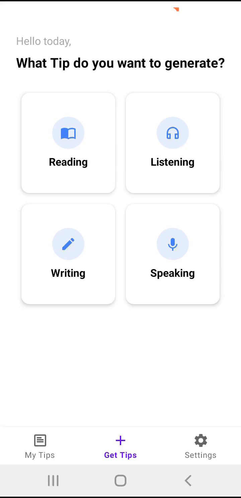

# IELTS Tip Generator



## Getting Started

1. Clone the repo
2. Generate a groq API key at [Groq API](https://console.groq.com/)
3. Add the API key to your `local.properties` file:

```
groq_api_key="abcd..."
```

4. Build and run the app
